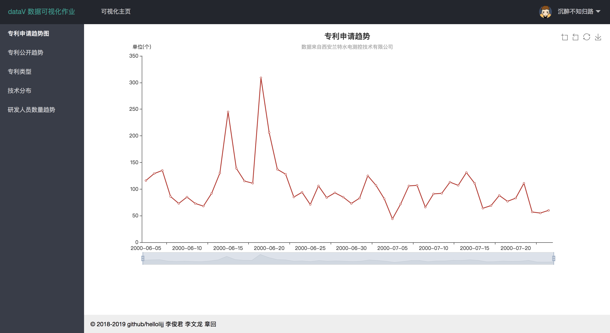
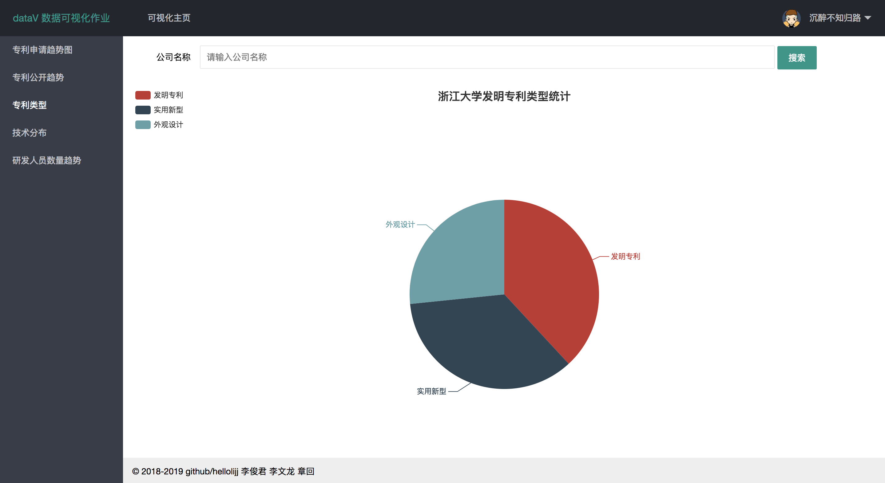
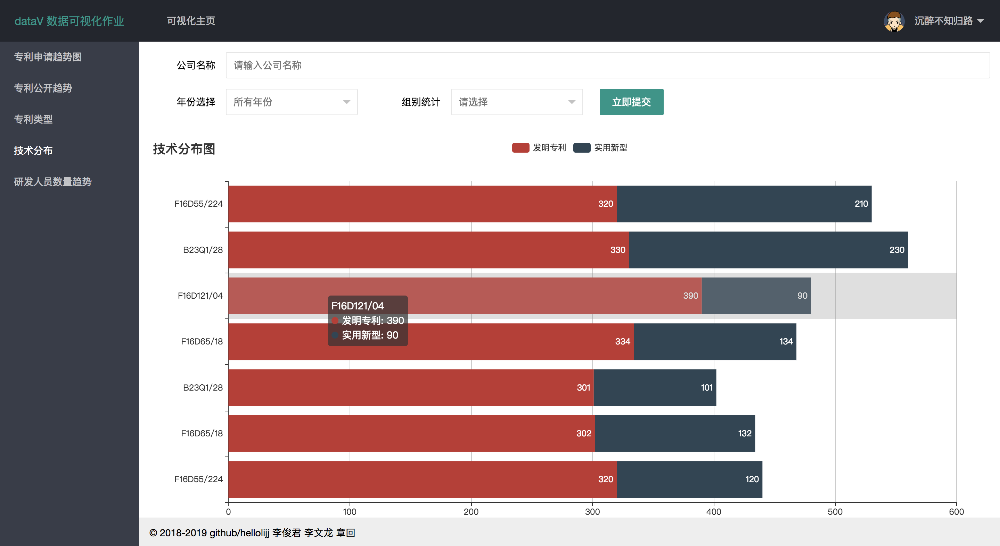

# 数据可视化作业前端页面

## 项目演示

http:demo.lijj.top:52004

## 项目部署
```
git clone https://github.com/hellolijj/dataV_front.git dataV_group
cd dataV_group
docker-compose up -d
```

## 前端架构

- 使用 [layui](https://www.layui.com/) 框架 平台的样式
- 使用 [echarts](http://echarts.baidu.com/) 展示可视化页面


## 作业小组成员
- [李俊君](https://github.com/hellolijj)
- 李文龙
- 章回

## 页面展示

### [专利申请趋势（折线图）](index.html)
申请趋势反应专利申请数随时间变化的趋势，以时间（年或季度）为横轴，统计“申请日”落在刻度时间段中的专利个数，以专利申请数为纵轴做折线图，连接相应的点，形成专利申请趋势。
此处的时间轴可以拖动变化显示的时间长短。



### [专利公开趋势（折线图）](public.html)
公开趋势烦应专利公开数随时间变化的趋势，以时间（年或季度）为横轴，统计“公开日”落在刻度时间段中的专利个数，以专利申请数为纵轴做折线图，连接相应的点，形成专利公开趋势。
此处的时间轴可以拖动变化显示的时间长短。

### [专利类型（饼图或标准环形图）](type.html)
专利类型用于反应公司持有专利的类型，统计“专利类型”项下发明专利、实用新型、外观设计各自的总数，按照比例呈现。


### [技术分布（条形堆积图）](technology.html)
技术分布用于反应公司持有专利的主要技术方向，此处仅对“专利类型”项为发明专利和实用新型的专利进行统计，不包括外观设计。
	“专利类型”为发明专利或实用新型的均具有“分类号”数据（注意不是“主分类号”），在抓取到的数据中，“分类号”以分号隔开，显示如下：
F16D55/224(2006.01)I;F16D65/18(2012.01)I;B23Q1/28(2006.01)I;F16D121/04(2012.01)N
忽略掉括号中的日期和括号后的字母，读取每一个专利的“分类号”数据，统计不同“分类号”出现的频率，因此我们可以获得不同“分类号”出现的频率，也可以同时获得该“分类号”对应的发明专利个数和实用新型个数，如下图：

可以根据图表的美观调整分类号纵轴上分类号的个数。
	功能提升一：在右下角提供下拉框，供用户选择对企业的全部数据进行统计或者仅对某一年的数据进行统计。
功能提升二：此前提到过，分类号是由5个片段组成，例如F16D55/224，分为F（部）、F16（大类）、F16D（小类）、F16D55（大组）和F16D55/224（小组），不知道在统计频率的时候统计到大组，比如第一行专利出现了F16D55/224，第二行出现了F16D55/22，统计时记为F16D55出现两次。在显示框的右下角出现一个下拉框，供用户选择用大组统计或者小组统计。

### [研发人员数量趋势（折线图）](research.html)
研发人员数量趋势用于反应公司研发人员的数量随时间变化的趋势，在抓取到的数据中，“发明（设计）人”以分号隔开，显示如下：
	田威;李鸣阳;韩锋;袁正茂;王杰
	以“公开日”	发人员数量。
以时间（年或季度）为横轴，以研发人员数量为纵轴做折线图，连接相应的点，形成研发人员数量趋势。
	此处的时间轴可以拖动变化显示的时间长短。


