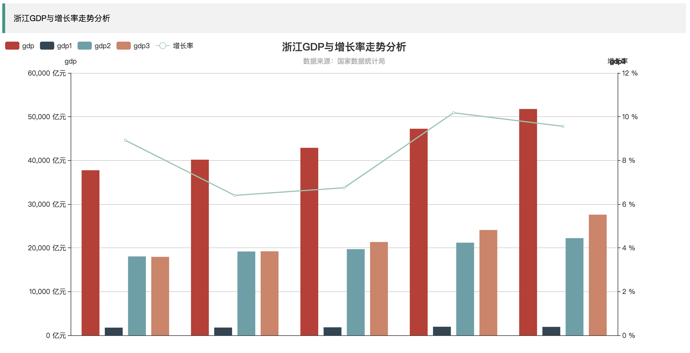
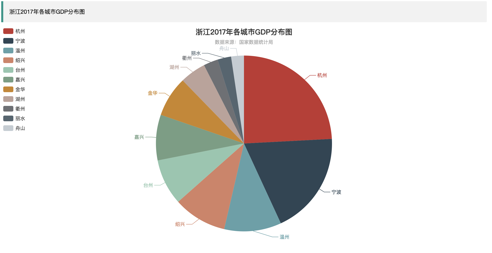
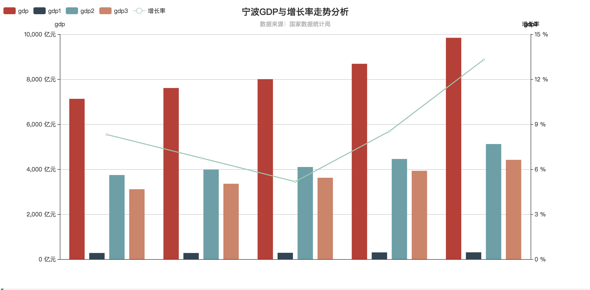
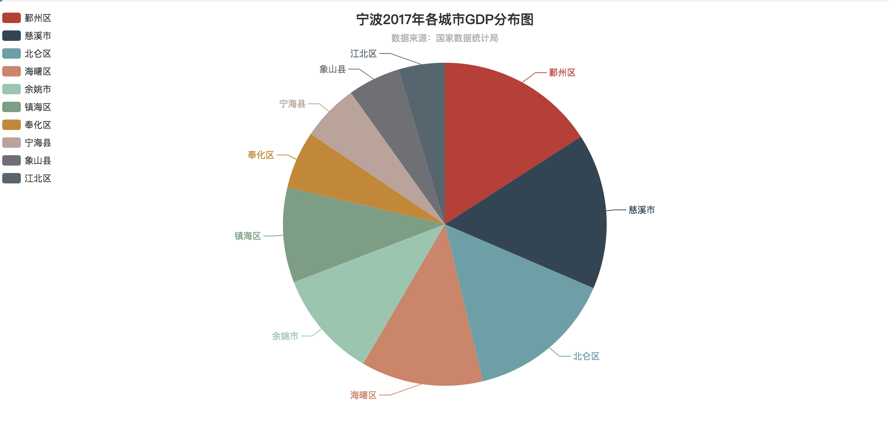
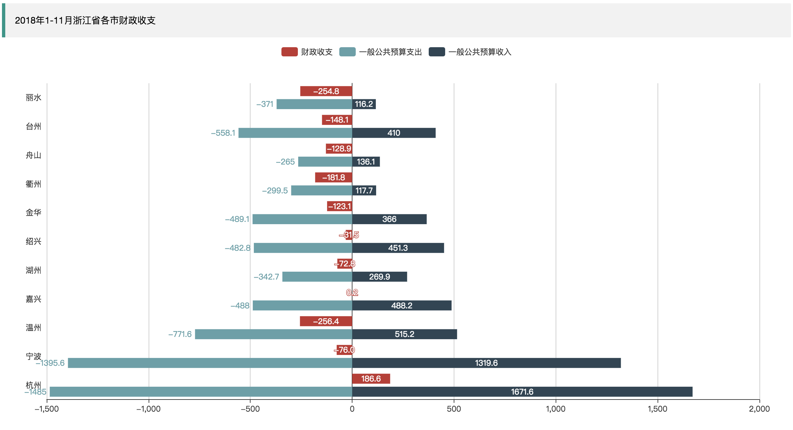
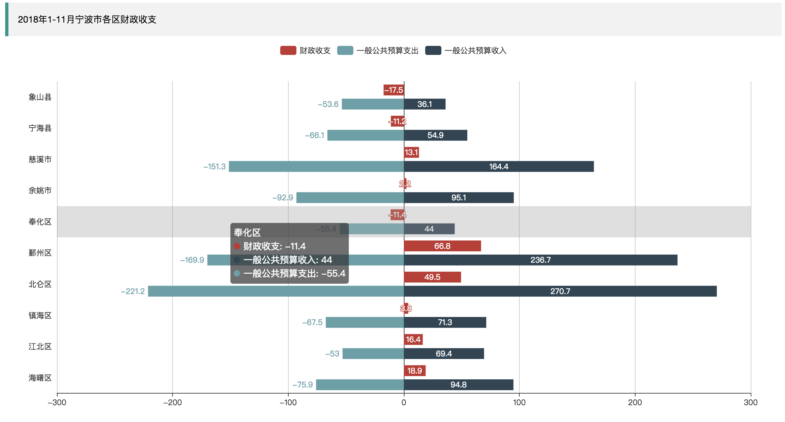
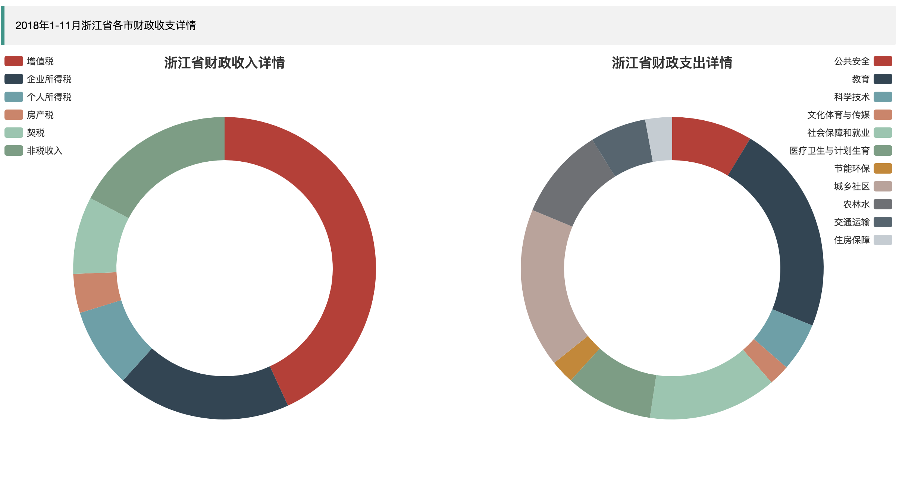
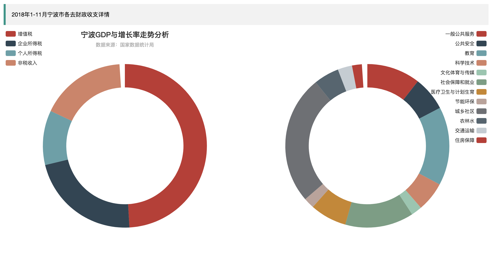

# 数据可视化个人作业前端页面

## 项目演示

http://demo.lijj.top:52003/

## 前端架构

- 使用 [layui](https://www.layui.com/) 框架 平台的样式
- 使用 [echarts](http://echarts.baidu.com/) 展示可视化页面

## 页面展示

### [浙江gdp趋势图（折线图）](index.html)

### [宁波gdp趋势图（折线图）](ningbo.html)

### [浙江财政](caizhen_zhejiang.html)

### [宁波财政](caizhen_ningbo.html)

### [浙江财政详情](shouzhi_zhejiang.html)

### [宁波财政详情](shouzhi_ningbo.html)

